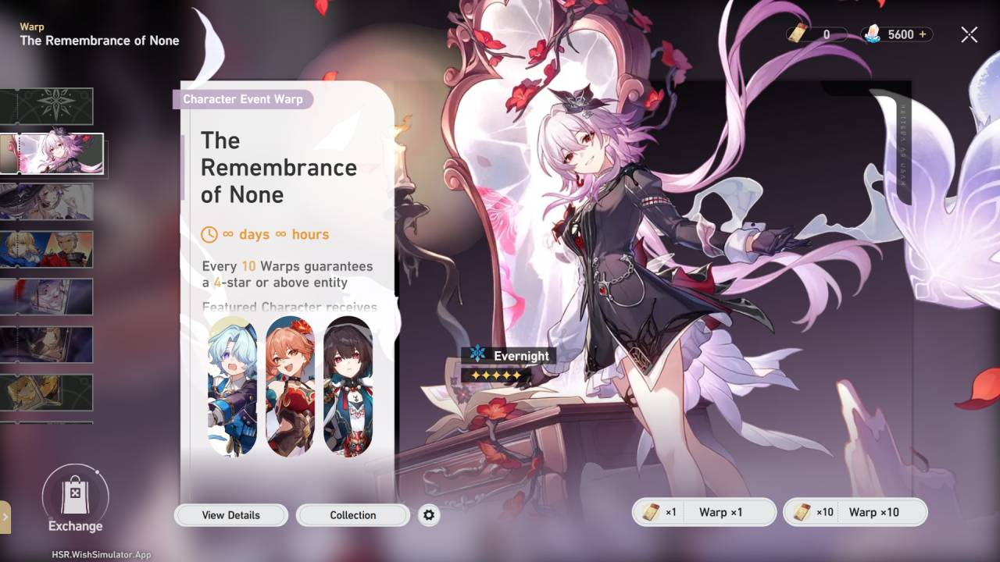

# Honkai: Star Rail Warp Simulator

  [](https://www.codefactor.io/repository/github/mantan21/hsr-warp-simulator)   [](https://saweria.co/Mantan21)

This project is similar to the [Genshin Impact Wish Simulator](https://github.com/Mantan21/Genshin-Impact-Wish-Simulator), I use the same algorithm and most of the code here I copy from there.

## Screenshots

#### Main Banner




#### Inventory


#### Inventory


#### Switch banner


#### Shop


> For more preview, please visit the live version at [https://hsr.wishsimulator.app](https://hsr.wishsimulator.app)

---

## Features

1. All banner types available ( Starter, Regular, Character and Light Cone Event )
2. Pity System almost like the real game.
3. **Warp Details** for each banner.
4. **Shop** section, Serving Gacha Currencies, Top Up function and More,
5. **Bank Data** to show all items ( Characters and Light Cones ) that obtained from gacha or purchasement
6. Different banner type has different **Gacha History**
7. **Phonograph** to select and play musics.
8. Gacha Milestone Bonus, exchangable to Star Rail Pass at the Shop section.
9. Shared Pity to the same banner type, User can continuously gacha on different patch without resetting pity.
10. Pity Counter, User can track their current information of their pity
11. Site Localization, So I hope this Wish Sim can reach more people even they aren't english speaker.
12. Mobile Friendly, responsive layout both landscape and portrait orientation.
13. Screenshot and download wish result as image localy.
14. Link generator if user want to share their gacha result through internet.
15. All data will be saved to LocalStorage and indexedDB.

## Pity System

I don't know how HoyoVerse's algorithm is, so I tried to create mine as realistic as possible with the following points based on in-game wish details.

> In order to get the same experience with the game when doing gacha, I tried to use the following formula for determining the gacha rates according to the current pity
>
> `baseRate + ((CurrentPity - HardPity) * additionalRate)`
>
> To get the number of `additionalRate`, I calculated `100% - baseRate` and divide it by the difference between `HardPity` to `MaxPity`.
> [Check here](https://github.com/Mantan21/HSR-Warp-Simulator/blob/master/src/lib/helpers/gacha/probabilities.js#L1-L15) to see how I implemented it as code

Based on the formula above, it can be concluded that the probability table is as follows:

1. Probability for 4★ item on Character Event Warp

   - 4★ item guaranteed at `10` roll and promoted 4★ item guaranteed at `20` roll.
   - Base rate to get 4★ item is `5.1%`, guaranteed to get 4★ item at pity `10`

   | **Pity** |  1   |  2   |  3   |  4   |  5   |  6   |  7   |  8   |   9    | ≥10  |
   | -------: | :--: | :--: | :--: | :--: | :--: | :--: | :--: | :--: | :----: | :--: |
   | **Rate** | 5.1% | 5.1% | 5.1% | 5.1% | 5.1% | 5.1% | 5.1% | 5.1% | 52.55% | 100% |

2. Probability for 4★ item on Light Cone Event Warp

   - 4★ item guaranteed at `10` roll and promoted 4★ item guaranteed at `20` roll.
   - Base rate to get 4★ item is `6.6%`, guaranteed to get 4★ item at pity `10`

   | **Pity** |  1   |  2   |  3   |  4   |  5   |  6   |  7   |  8   |   9    | ≥10  |
   | -------: | :--: | :--: | :--: | :--: | :--: | :--: | :--: | :--: | :----: | :--: |
   | **Rate** | 6.6% | 6.6% | 6.6% | 6.6% | 6.6% | 6.6% | 6.6% | 6.6% | 53.30% | 100% |

3. Light Cone Warp Probability

   - 5★ Item guaranteed at `80` roll and promoted 5★ item guaranteed at `160` roll.
   - Probability to get 5★ item is `0.8%`, the rate starts to increase at pity 63 and then guaranteed at pity `80`.

   | **Pity** | ≤62  |  63   |   64   |   65   |   66   |   67   |   68   |   69   |   70   |   71   |   72   |   73   |   74   |   75   |   76   |   77   |   78   |   79   | ≥80  |
   | -------: | :--: | :---: | :----: | :----: | :----: | :----: | :----: | :----: | :----: | :----: | :----: | :----: | :----: | :----: | :----: | :----: | :----: | :----: | :--: |
   | **Rate** | 0.8% | 6.31% | 11.82% | 17.33% | 22.84% | 28.35% | 33.86% | 39.38% | 44.88% | 50.40% | 55.91% | 61.42% | 66.93% | 72.44% | 77.95% | 83.47% | 88.98% | 94.49% | 100% |

4. Character Event and Regular Warp Probability

   - 5★ Item guaranteed at `90` roll and promoted 5★ item guaranteed at `180` roll.
   - Probability to get 5★ item is `0.6%`, the rate starts to increase at pity 74 and then guaranteed at pity `90`.

   | **Pity** | ≤73  |  74   |  75   |   76   |   77   |   78   |   79   |   80   |   81   |   82   |   83   |   84   |   85   |   86   |   87   |   88   |   89   | ≥90  |
   | -------: | :--: | :---: | :---: | :----: | :----: | :----: | :----: | :----: | :----: | :----: | :----: | :----: | :----: | :----: | :----: | :----: | :----: | :--: |
   | **Rate** | 0.6% | 6.45% | 12.3% | 18.14% | 23.99% | 29.83% | 35.68% | 41.53% | 47.38% | 53.22% | 59.07% | 64.92% | 70.76% | 76.61% | 82.46% | 88.30% | 94.15% | 100% |

5. When you guaranteed for 5★ and 4★ item at the same time, your next pull priority is 5★ item and 4★ item will appear next at pity 11. For example: On Character Event Banner, you doesn't get 5★ item until pity 89 and your 4★ pity is 9, So your next pull will looks like screenshot below.

   

## Development

This app build with [Svelte-Kit](https://kit.svelte.dev/) based on Javascript programming language.

> NodeJS 18.x is required!

Once you've cloned this project, install all dependencies with `npm install` (or `pnpm install` or `yarn`). Once all dependencies already installed, then you can start a development server or build for production:

```bash
npm run dev

# or start the server and open the app in a new browser tab
npm run dev -- --open
```

<!-- ### How to Update new banner

- The guide to Add New Banner are moved to Wiki, [Read Here](https://github.com/Mantan21/HSR-Warp-Simulator/wiki/How-to-Add-more-Banner) -->

## Building

Before creating a production version of your app, install an [adapter](https://kit.svelte.dev/docs/adapters) for your target environment, then run the command below. As default, this project use [Static Adapter](https://github.com/sveltejs/kit/tree/master/packages/adapter-static)

```bash
npm run build
```

## Contributing

I'm welcome to all contributors! Feel free to [Open New Issue](https://github.com/Mantan21/HSR-Warp-Simulator/issues/new) if you find any problem or just want to give any suggestions.

<!-- ### Thank You to all Contributors

[](https://github.com/Mantan21/HSR-Warp-Simulator/graphs/contributors) -->

> **Notes :**
>
> The data and assets used for this Project are taken from [Hoyo Wiki](https://wiki.hoyolab.com), [HSR Fandom Wiki](https://honkai-star-rail.fandom.com/wiki/Honkai:_Star_Rail_Wiki), [Honey Impact](https://hsr.honeyhunterworld.com/), [Project Yatta](https://hsr.yatta.top/), [Hakush](https://hsr.hakush.in/) and recorded from the game itself with several modification. <br/> **Important thing**: This App is not affiliated with Hoyoverse, all assets used for this application belongs to [HoYoVerse](http://hoyoverse.com/), so if you want to use assets from this repository, please keep in mind to credit them too.
